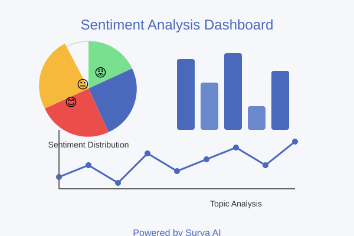

# Sentimax - Text Sentiment Analysis Dashboard

Sentimax is a Flask-based web application powered by Surya AI that allows users to upload text files or paste comments for sentiment analysis. The application generates a comprehensive visual dashboard with sentiment metrics, charts, and insights.



## Features

- **Text Input Options**: Upload .txt files or paste text directly
- **Sentiment Analysis**: Advanced scoring of comment sentiment
- **Topic Classification**: Automatic categorization into relevant topics
- **Visual Analytics**: Comprehensive charts and graphs
- **Emotional Content Analysis**: Identification of emotions in text
- **Word Cloud Generation**: Visual representation of important words
- **Trend Analysis**: Track sentiment changes over time
- **Detailed Comment Analysis**: Individual sentiment scores for each comment

## Dashboard Components

The analysis dashboard includes:

- Sentiment Distribution (Histogram)
- Feedback Type Distribution (Pie Chart)
- Top 15 Words (Bar Chart)
- Comments by Topic (Horizontal Bar Chart)
- Sentiment Trend (Line Chart)
- Emotional Content (Bar Chart)
- Sentiment by Topic (Bar Chart)
- Word Cloud Visualization

## Installation

1. Clone this repository:
```bash
git clone https://github.com/yourusername/sentimax.git
cd sentimax
```

2. Create a virtual environment and activate it:
```bash
python -m venv venv
source venv/bin/activate  # On Windows: venv\Scripts\activate
```

3. Install the required packages:
```bash
pip install -r requirements.txt
```

4. Download required NLTK data:
```python
import nltk
nltk.download('punkt')
nltk.download('stopwords')
nltk.download('vader_lexicon')
```

5. Run the application:
```bash
python app.py
```

6. Open your browser and navigate to:
```
http://127.0.0.1:5000/
```

## Usage

1. On the homepage, either upload a .txt file or paste your comments in the text area.
2. Click on the "Analyze" button to process your text.
3. View the generated dashboard with sentiment analysis results.
4. Explore different charts and metrics to gain insights from your data.

## Project Structure

```
sentimax/
├── app.py                  # Main Flask application
├── requirements.txt        # Python dependencies
├── README.md               # Project documentation
├── static/                 # Static files
│   ├── css/
│   │   └── style.css       # Application styles
│   └── images/
│       └── sentiment_analysis.svg  # Illustration image
└── templates/              # HTML templates
    ├── index.html          # Homepage
    └── results.html        # Results dashboard
```

## Customization

You can customize the application by:

- Modifying the topic categories in `app.py`
- Adjusting the emotion keywords for detection
- Changing the color scheme in `style.css`
- Adding new types of visualizations to the dashboard

## Technologies Used

- Flask
- Pandas
- NLTK (Natural Language Toolkit)
- Matplotlib & Seaborn
- WordCloud
- HTML/CSS

## License

This project is licensed under the MIT License - see the LICENSE file for details.

## Acknowledgments

- Surya AI for powering the sentiment analysis capabilities
- NLTK for natural language processing tools
- Matplotlib and Seaborn for data visualization

---

© 2025 Sentimax. All rights reserved.